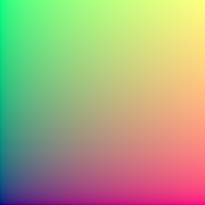
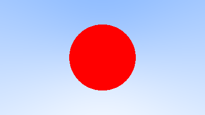
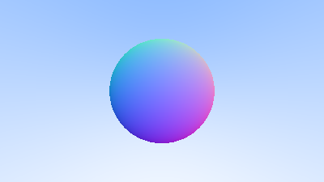
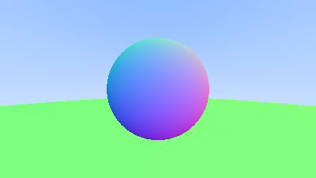
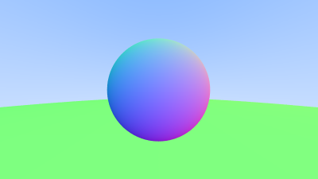
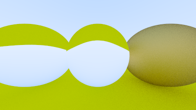
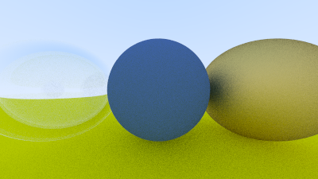
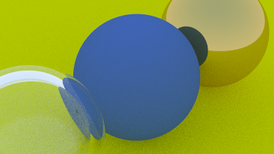
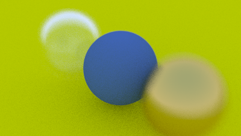
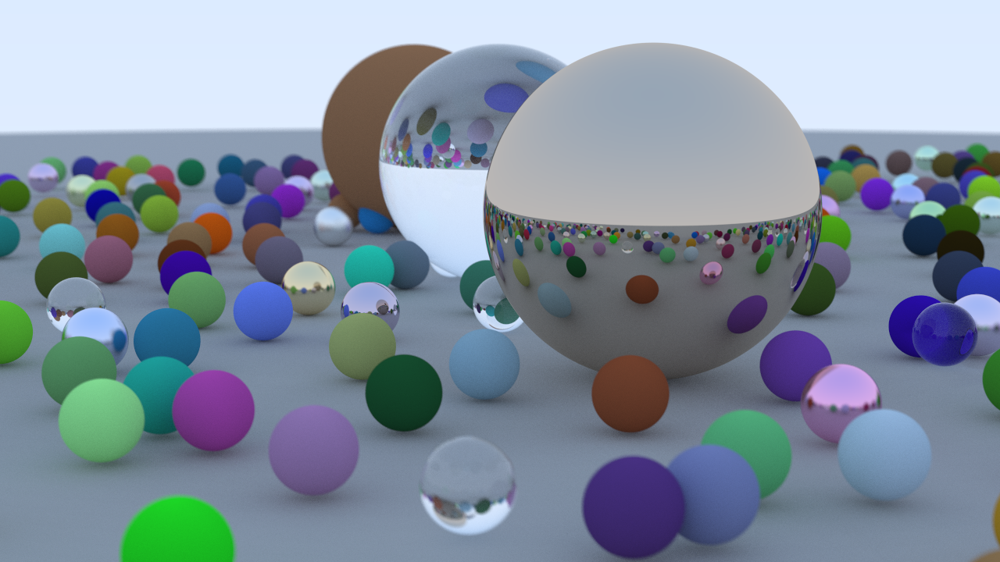

# LightRay


## 1) Introduction

LightRay is a physically based raytracer written in Rust.

The starting point for LightRay is Peter Shirley's excellent book series starting with [_Ray Tracing In One Weekend_](https://raytracing.github.io/books/RayTracingInOneWeekend.html).  The project will then be extend towards photorealistic rendering given previous experience with such renderers.


## 2) Output an Image

The LightRay 0.2.0 release corresponds with [_Ray Tracing In One Weekend_ Chapter 2](https://raytracing.github.io/books/RayTracingInOneWeekend.html#outputanimage) which creates a simple gradient image and writes it to stdout in the PNM image format.  The output for 0.2.0 is the same gradient image created by the original source.

```bash
cargo run --release > current.pnm
display current.pnm
```
_(Using ImageMagick to display PNM files.)_

.

There are a few differences between the LightRay implementation and the version presented in the book.

1) The nested for loop has been replaced with a more rusty iterator loop that clunkily recomputes i and j but transparently supports per-pixel parallel rendering by using into_par_iter() from Rust's "rayon" package.

2) The progress meter has been removed to simplify parallel rendering support.

3) The output of this version is a P6 binary PNM rather than a P3 text PNM.  P6 is also a simple header followed by W*H*3 bytes rather than text.  P6 is closer to what is created internally and is a more compact format.

4) A simplified Color struct from Chapter 3 has been implemented ahead of time along with the Color to u8 converter used by the PNM writer.

5) The f32 type was chosen over f64 primarily to enable future SSE optimization.  Use of f32 results in only a 5-10% faster render on the development machine.


## 3) Points, Vectors, and Colors

The LightRay 0.3.0 release adds support for Vector3, Point3 and Color structs.  These are implemented similarly to [_Ray Tracing In One Weekend_ Chapter 3](https://raytracing.github.io/books/RayTracingInOneWeekend.html#thevec3class) except using Rust traits to support operations.  Implementing these for Chapter 3 does not change the generated image in any way.

Unlike the reference book the Vector3, Point3, and Color structs are distinct types.  There are several reasons for this.

1) Distinct types means that the operations on vectors and points can be limited to those that make sense.  For example `P + V -> P`, `P + P -> undefined`, `V * V -> undefined`.  Getting these correct means catching math mistakes at compile time.

2) The Neg and Sub traits on Color are not physically based(outside of quantum effects) and trying to use them generally means there is a computation error.  They are not present in this implementation to prevent that from happening, although they could be added back for artistic reasons.

3) For physically based rendering the Color struct should be samples in the frequency domain and not RGB which is a perceptual domain.  These are close but using RGB can lead to subtle blending issues.  This is not yet implemented but is anticipated for a far future release.

There are some other design differences as well.

1) The operation traits do not support borrow versions at this time and the structs support Copy.  Testing showed that #[inline] and Copy were about the same speed as explicitly borrowing everywhere while making the math operations less clunky.

2) Casts of Color/Point3/Vector3 to/from slices is not yet supported.  Realistically these operations will ultimately be needed in some way to import triangle meshes efficiently.


## 4) Rays, a Simple Camera, and Background

The LightRay 0.4.0 release is a straightforward and rather uninteresting Rust implementation of [_Ray Tracing In One Weekend_ Chapter 4](https://raytracing.github.io/books/RayTracingInOneWeekend.html#rays,asimplecamera,andbackground).


## 5) Adding a Sphere

The LightRay 0.5.0 release implements a simple Sphere intersection test following the example in [_Ray Tracing In One Weekend_ Chapter 5](https://raytracing.github.io/books/RayTracingInOneWeekend.html#addingasphere).  For simplicity the hit_sphere function was placed in main.rs as it will subsequently be moved around with the creation of a Hittable struct.  The code also passes the Ray around by borrow as it will be reused more and more.




## 6a) Surface Normals

The LightRay 0.6.0 release implements [_Ray Tracing In One Weekend_ Chapter 6](https://raytracing.github.io/books/RayTracingInOneWeekend.html#surfacenormalsandmultipleobjects) but only up to the end of Chapter 6.2 with the simplified sphere intersection code.  The release was cut in this way as it provides a natural image verification step for the renderer.  Running the 0.6.0 release and viewing the result should match the image from the book.



The primary difference between the reference implementation and LightRay is that hit_sphere returns an Option<f32> rather than a magic value for the no intersection case.


## 6b) Multiple Objects

The LightRay 0.6.1 release implements multiple object support for the remainder of [_Ray Tracing In One Weekend_ Chapter 6](https://raytracing.github.io/books/RayTracingInOneWeekend.html#surfacenormalsandmultipleobjects).  For Rust this is done by creating a Hittable trait along with a HittableList struct for handling multiple objects.  The hit function is then dynamically dispatched based upon the underlying type.

To support parallelism the world objects are all wrapped with Arc for thread safe reference counting and the dispatch type is augmented with 'Sync + Send'.




## 7) Antialiasing

The LightRay 0.7.0 release mirrors [_Ray Tracing In One Weekend_ Chapter 7](https://raytracing.github.io/books/RayTracingInOneWeekend.html#antialiasing) by adding support for antialiasing as well as a simple camera model.  There are a couple of differences between LightRay and the original:

1) The LightRay Camera constructor takes in the aspect_ratio as an argument for matching with the image aspect ratio.

2) Random sampling of the pixel is done in main.rs rather than in the camera code.

The resulting image is similar to the previous image except smoothed.  Because this image is created by casting randomized rays it may have minor pixel differences from run to run.



Note that uniform random sampling of each pixel converges more slowly than jittered sampling for just the one bounce edge antialiasing which generally looks good at around 16 samples.  The assumption here is that non-forking rays require many more samples to be taken to handle subsequent bounces anyway.


## 8) Diffuse Materials

The LightRay 0.8.0 release adds Lambertian light scattering as explained in [_Ray Tracing In One Weekend_ Chapter 8](https://raytracing.github.io/books/RayTracingInOneWeekend.html#diffusematerials). LightRay will be using the corrected Lambertian formula with random_in_hemisphere.  The other two methods from the book are provided in the source code (commented out) for experimentation purposes.

This version also hard codes a gamma of 2.0 when converting Color to u8 (in color.rs).

Again the sample image is not readily reproducible because the rays are randomly generated resulting in pixel noise that varies from run to run.

 Metal

The LightRay 0.9.0 release adds support for Metal light scattering and dispatchable materials.  The Metal and Material implementations correspond to [_Ray Tracing In One Weekend_ Chapter 9](https://raytracing.github.io/books/RayTracingInOneWeekend.html#metal).  The main differences between LightRay and the book are as follows:

1) LightRay returns the `scatter` result directly rather than via mutable function parameter.  It bundles the attenuation color and new scatter direction into a Option<tuple>.  It returns None if there is no scatter.

2) The Material trait is wrapped in Arc for reference counting which is then explicitly cloned into the HitRec structure.  However a more performant implementation of the renderer should separate the world creation and rendering steps and then all rendering can be done via borrow with zero clones or copies of the world objects.  Likewise for the reference code which uses shared_ptr but does not need to reference count anything while rendering.

3) The Lambertian struct in LightRay has switched to use the random_in_hemisphere method for computing scatter rays.  It also handles zero length scatter directions.

 Dielectrics (Refraction)

The LightRay 0.10.0 release adds a simple refractive-only Dielectric material as well as a test case for using it.  It follows [_Ray Tracing In One Weekend_ Chapter 10](https://raytracing.github.io/books/RayTracingInOneWeekend.html#dielectrics) up to the refractive-only image generated at the end of 10.2.




## 10b) Dielectrics (Snell's Law)

The LightRay 0.10.1 release adds the completed Dielectric material along with the final image setup for [_Ray Tracing In One Weekend_ Chapter 10](https://raytracing.github.io/books/RayTracingInOneWeekend.html#dielectrics).




## 11) Positionable Camera

The LightRay 0.11.0 release is a straightforward implementation of the positionable Camera struct from [_Ray Tracing In One Weekend_ Chapter 11](https://raytracing.github.io/books/RayTracingInOneWeekend.html#positionablecamera).




## 12) Defocus Blur

The LightRay 0.12.0 release implements camera focal distance blur from [_Ray Tracing In One Weekend_ Chapter 12](https://raytracing.github.io/books/RayTracingInOneWeekend.html#defocusblur).




## 13) A Final Render

The LightRay 0.13.0 release just adds the final scene and image from [_Ray Tracing In One Weekend_ Chapter 13](https://raytracing.github.io/books/RayTracingInOneWeekend.html#wherenext?) which corresponds to the image on the book cover.  The scene consists of randomized spheres and varies from run to run.


